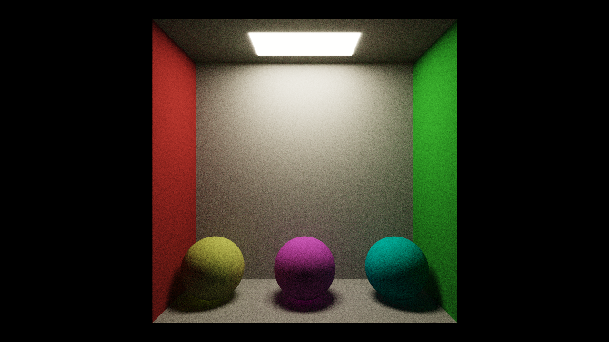

# TraceSharp - a C# path-tracer
## About
This project is to demonstrate a wide variety of software engineering skills.
I've tried my best to show the kind of code I would write in a production environment, including unit tests.

The project itself isn't meant to be used as a production-grade renderer. It's just a fun and interesting way for me to show my skills.

There are a lot of things I would've liked to implement but in the end this project is not meant to be a renderer. It is meant to show you a typical example of the quality of my code in a somewhat professional environment.

## Project structure
- [Media](./Media) contains various screenshots taken while developing the application.
- [PathTracer](./PathTracer) is the project directory.
    - [Math](./PathTracer/Math) contains mathematical constructs and helper functions.
    - [Primitives](./PathTracer/Primitives) contains primitives that can intersect a ray.
    - [Properties](./PathTracer/Properties) contains AssemblyInfo.cs.
    - [Rendering](./PathTracer/Rendering) contains classes used to render scenes.
- [UnitTests](./UnitTests) contains a unit testing project to ensure all core systems are functioning.
    - [Math](./UnitTests/Math) contains math unit tests.
    - [Primitives](./UnitTests/Primitives) contains primitive intersection unit tests.
    - [Properties](./UnitTests/Properties) contains AssemblyInfo.cs.
    - [Rendering](./UnitTests/Rendering) contains rendering object unit tests.

## Usage
Default settings should generate a pretty noisy image.
This is to be expected. All settings can be modified in the App.config file.
Feel free to play around with it to see what effect it has on the final image.

## Resources
- Peter Shirley's "*Ray Tracing in a ___*" series
- Alan Wolfe's "*casual path tracing*" blog posts.

## Sample output

Type | statistics
------------ | -------------
Resolution | 1280 x 720 pixels
Samples per pixel | 2048
Bounces | 8
