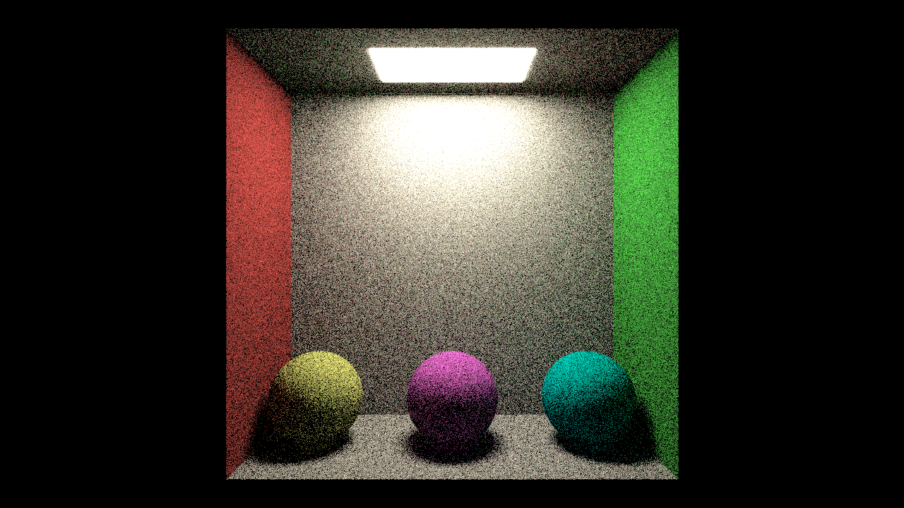
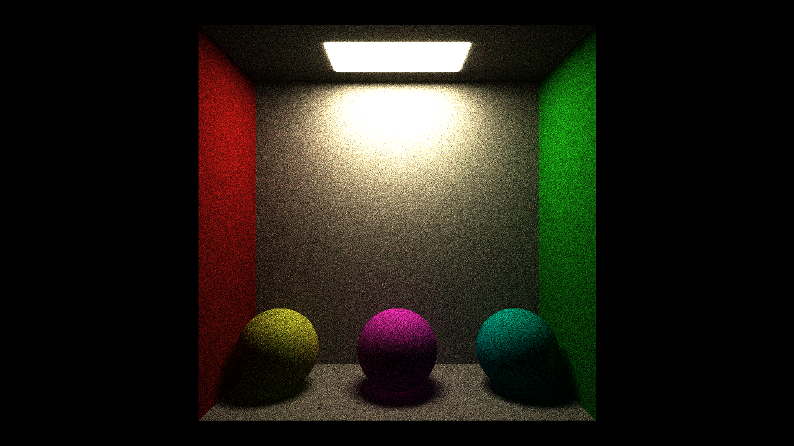
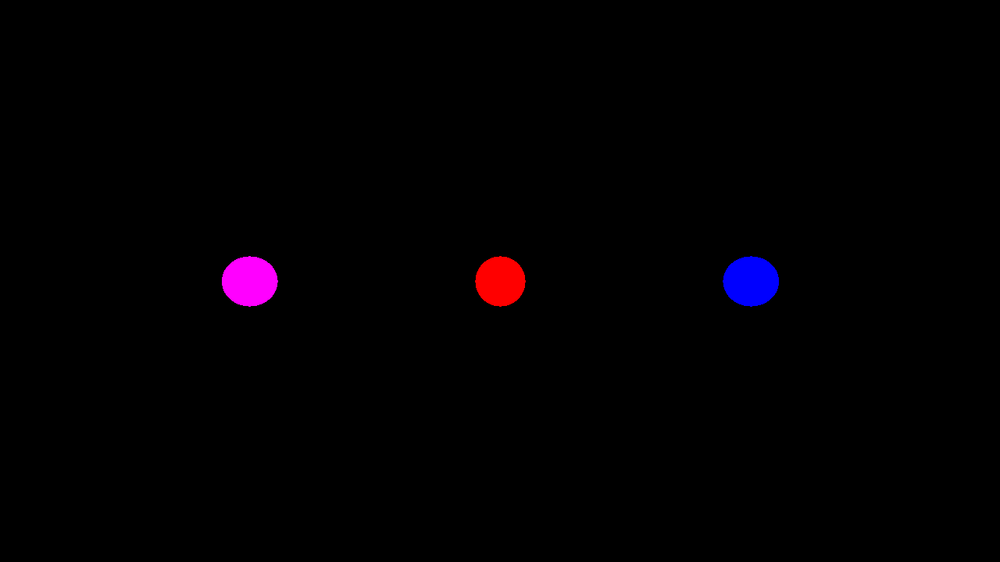
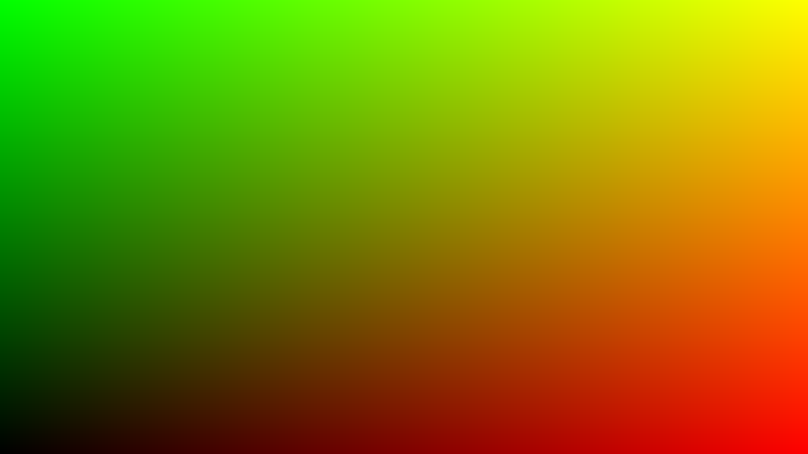

# TraceSharp - a C# path-tracer
## About
This project is to demonstrate a wide variety of software engineering skills.
I've tried my best to show the kind of code I would write in a production environment, including unit tests.

The project itself isn't meant to be used as a production-grade renderer. It's just a fun and interesting way for me to show my skills.

There are a lot of things I would've liked to implement but in the end this project is not meant to be a renderer. It is meant to show you a typical example of the quality of my code in a somewhat professional environment.

## Resources
- Peter Shirley's "*Ray Tracing in a ___*" series
- Alan Wolfe's "*casual path tracing*" blog posts.

## Timeline (reverse chronological order)

### 28/06/2020 - tone mapping and exposure
Type | statistics
------------ | -------------
Resolution | 1280 x 720 pixels
Samples per pixel | 2048
Bounces | 8

### 28/06/2020 - gamma correction
Type | statistics
------------ | -------------
Resolution | 1280 x 720 pixels
Samples per pixel | 128
Bounces | 4

### 28/06/2020 - basic path tracing
Type | statistics
------------ | -------------
Resolution | 1280 x 720 pixels
Samples per pixel | 256
Bounces | 16

---

### 27/06/2020 - simple sphere intersection
Type | statistics
------------ | -------------
Resolution | 1280 x 720 pixels
Samples per pixel | 1
Bounces | 0

---

### 26/06/2020 - UV coordinates and ppm image output
Type | statistics
------------ | -------------
Resolution | 1280 x 720 pixels

